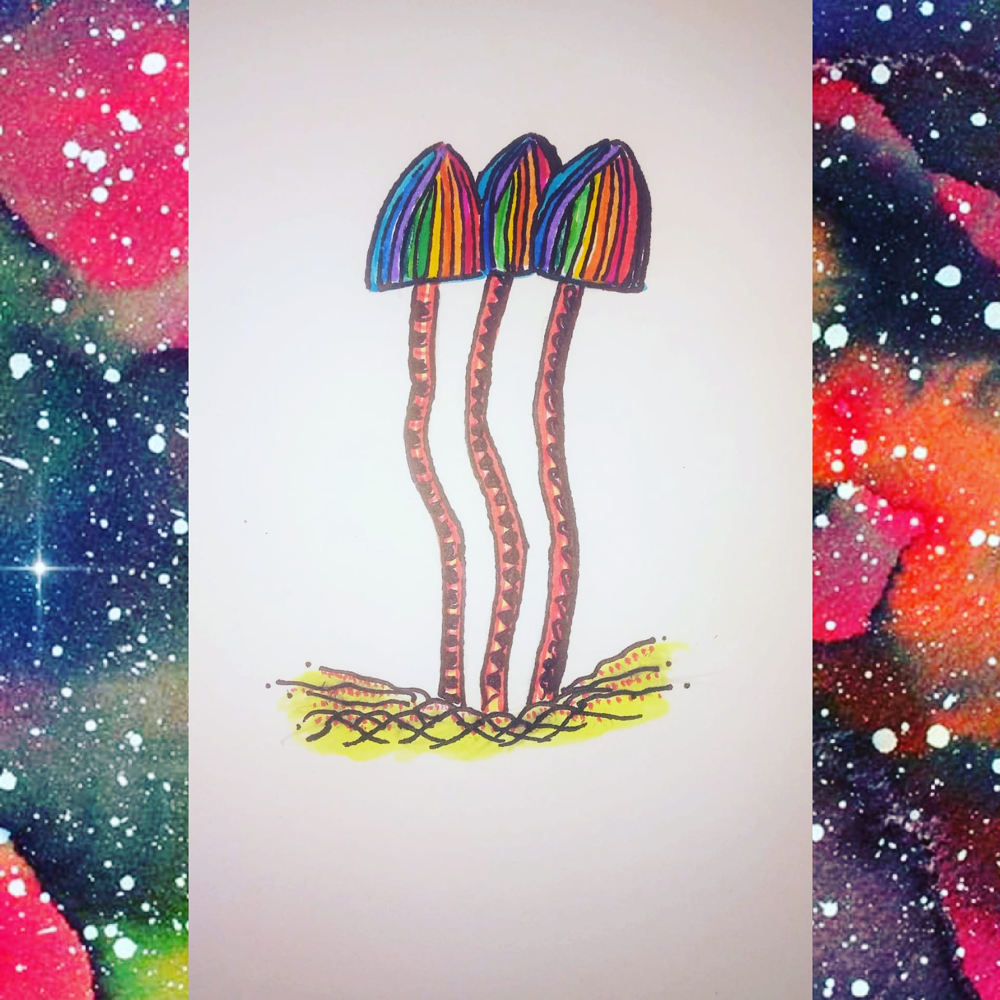

Trying something new
---------------
If this works I'm a freaking genius. Or as a developer friend told me -a certified nerd. For all those of you who don't know me I suck at technology. So making my own website is kind of a big deal to me. But I'm excited about trying something new and I just hope that the will sticks around long enough for something good to come out of this. 

Welcome to Writers-block! A space dedicated to pouring my heart out and picking up a few things along the way. At this point I'm not too worried about the content or the true purpose of this website and the focus right now is to figure out the aesthetics. (so shallow I love it..) But whatever. My site. My rules. SO ya. That's it. Stick around if you want to see what happens next.

Ok so today I learnt a little about Markdown and some of its basic syntax. And I dont want to go into too much detail but I learnt how to  
Insert a line break! And a thing or two about headings and paragraphs as you can see. :) Can't wait to try out more fun stuff. Did I mention learning is fun!

Now for no reason at all here is a **bold** word and even lesser reason for a random *italicized* word.  
Guys its working! Such happy. Much wow. 

Ok lets get a little real. As an ode to pouring my heart out, I think its only fair to atleast put out a post celebrating that spirit. I wrote a poem a while back and I think it deserves to go here. 

Scribbles
---------------------
My brain is broken.  
I hate everyone for pointing out the truth.  
It’s period time so truth seems harsher.  
Is what Im feeling pain?  
Fuck drugs.  
Happiness is eating a kebab cooked from scratch.  
This was last night.  
I run as an escape.  
I run to escape.  
I run away.  
Away from?  
No epiphanies here.  
Like in the movies.  
I know so much yet im lost. (Yuck)  
But maybe I know nothing (Yay)  
Which is it?  
Looks like the latter.  
Memes for a punctuated lol.  
Balance Priorities Relationships  
Now its just a list.  
Listless as I type.  
I find myself here often.  
Breaking into breaks.  
Smoke breaks.  
Maybe I need to quit.  
Always maybe.  
I want a baby.  
Tall dark and ugly.  
Beau baby.  
Clarity is crucial.  
Words are misleading.  
Want or need.  
Either way its complicated.  
These words are called scribbles.  
The only thing that makes sense.  
Is a Shaman from a song.  
Wandering into a forest.  
Lawless.  
Animated.  
Wild.  
Just like my brain which is broken.  
From scribbles to scrambled.  
Fin.

